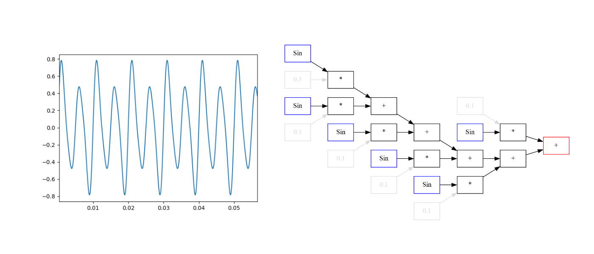
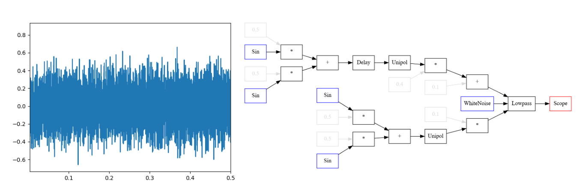
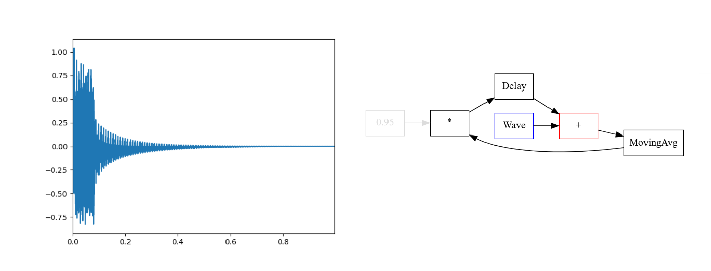
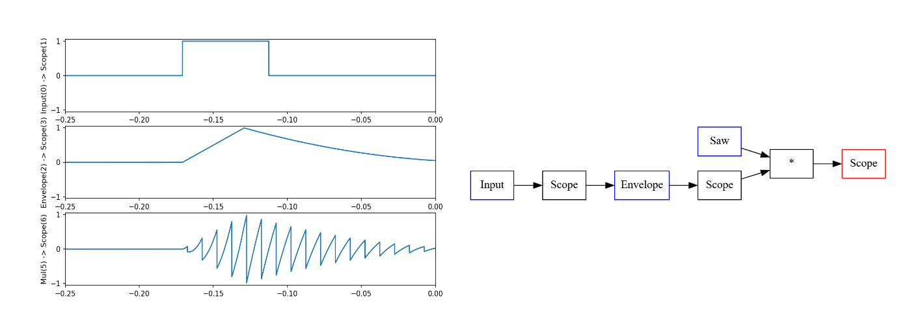

Intuitive sound synthesis in python.


## Installation

```
git clone https://github.com/MatejBevec/pynth
pip install ./pynth
```

## Usage

### Overtones
```python
from pynth import *
out = 0.5 * Sin(200)
for i in range(5):
out += 0.1 * Sin(100*i)
drawgraph(out)
showsound(out, t2=0.1)
out.play(5*SR)
```



### Vocal remover
```python
sample, sr = librosa.load("file.wav", mono=False)
l = Wave(sample[0, :])
r = Wave(sample[1, :])
SR = sr
out = 0.5 * (0.5*l - 0.5*r)
out += 0.5 * MovingAvg(0.5*l + 0.5*r, M=50)
```


### Procedural wind
```python
noise = WhiteNoise()
cutmod = Unipol(.5*Sin(1/3) + .5*Sin(1/5)) * 0.1
resmod = Unipol((.5*Sin(1) + .5*Sin(.8)) >> 0.3)
resmod = resmod * 0.4 + 0.1
out = Scope(Lowpass(noise, cutmod, resmod))
```



### Karplus-Strong string emulator
```python
noise = Wave(np.random.rand(4000)-0.5)
delay = Delay(None, delay=0.005)
add = noise + delay
delay.ins["a"] = 0.95 * MovingAvg(add, M=10)
out = add

frozen = Wave(add.eval(2*SR))
```



### User input, envelopes and scopes
```python
import keyboard
control = Input()
env = Envelope(Scope(control), (2000, 0, 0, 8000))
out = Scope(env)
out = Scope(out * Saw(100))
val = 0
def loop(t):
if keyboard.is_pressed(’l’):
control.set(1)
else:
control.set(0)
out.play(30*SR, live=True, callback=loop)
```




## More info

Feel free to read `DESCRIPTION.pdf` and check out `examples.py`.